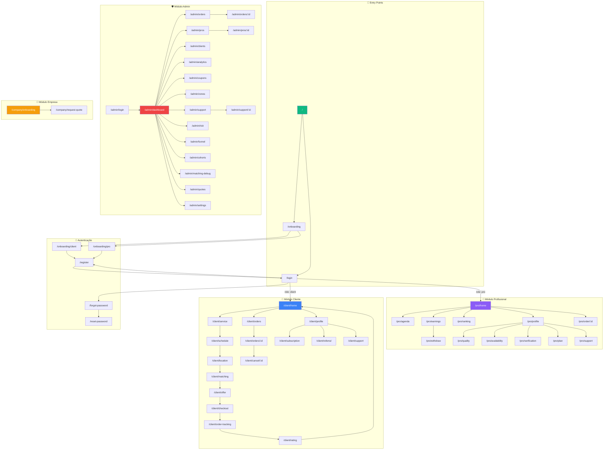
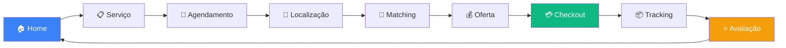
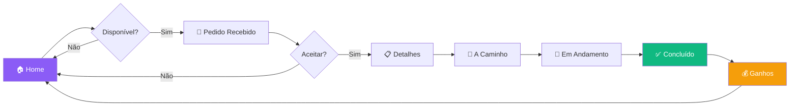
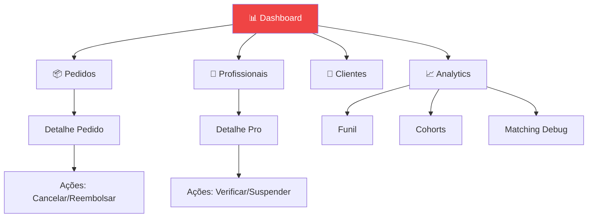
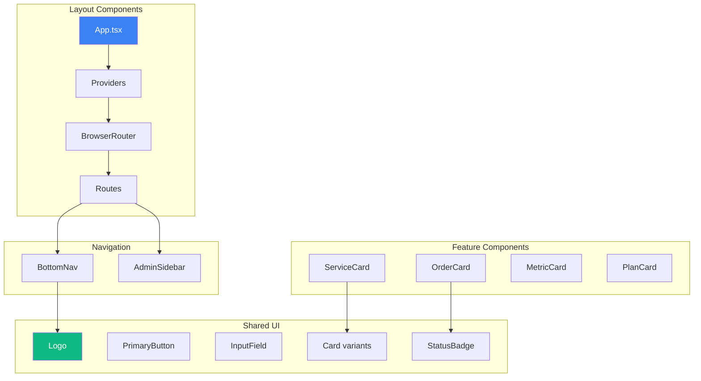
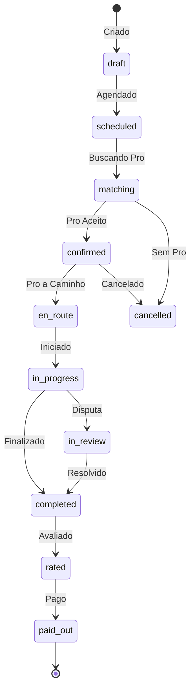
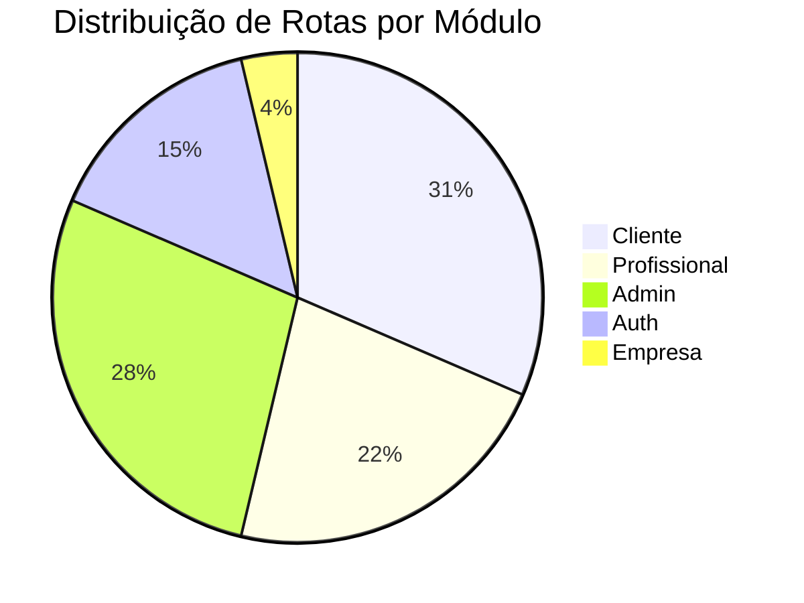

# 🗺️ JáLimpo - Sitemap Visual

## Visão Geral da Navegação

## Fluxo de Booking (Cliente)

## Fluxo de Trabalho (Profissional)

## Fluxo Admin

## Hierarquia de Componentes

## Estados de Pedido

## Níveis de Acesso

---

*Documentação gerada automaticamente - JáLimpo v1.0.0*
